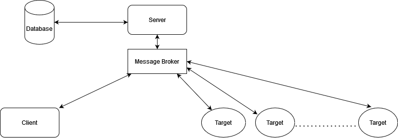

# Ch0nkyBear
Evolution from ch0nky. Check out our [extra special feature](#Extra-Special-Feature)

## Architecture  

### C2 Server
-   Handles connections from multiple operators and implants
-   Using Flask as primary listener with Gunicorn as the WSGI
-   Using flask-SqlAlchemy to facilitate CRUD operations on agents and operators
-   UI Interface to control the server and interact with the implant

### Implant
- checks if target has ch0nky.txt on file
-  Cryptography
	-   AES-GCM (In Progress)
-   Situational awareness: 
    - Machine GUID (primary key)
	- Computer Name
	- Username
	- Can execute remote commands so can escalate priveleges and gain any system info if required.
-   Queries RUN key to check if implant has already infected the system.
-   Execution
	-   Remote Command Execution
	-   DLL Injection 
	-   Reflective DLL injection (Ongoing)
	-   Integrate framework such as Donut (Maybe)
-   Loot: chromium stealer - passwords, cookies, autofill, web history from all user profiles (In Progress)
-   Persistence - RUN registry key
-   Defense Evasion - UPX packer to obfuscate payload.

### Database - PostgreSQL
-   Clients: operators connected to the C2
    - Client can remotely execute commands on specific implants registered with the C2 server
-   Jobs: Jobs sent to implants along with status of the job and the output response
-   Implants:
	-   Machine GUID (primary key)
	-   Computer Name
	-   Username
	-   Commands executed and responses
	-   First Seen: First check in/ register time
	-   Laster Seen: Last comm with agent

### Special Features:
- Initial Access Payload (Emulates ch0nky)
- Remote Command Execution
- Programatically control C2 via API
- HTTP panel to control implant (with secure authentication)
- Cryptography (In Progress)

### Extra Special Feature:
Repurpose ch0nky malware (malDoc, stager and implant) to work with ch0nkyBear C2 server. The power of ch0nky now lies with us. <- Instant A featue? - yeah definetly cuz ch0nky has been hacked :)
