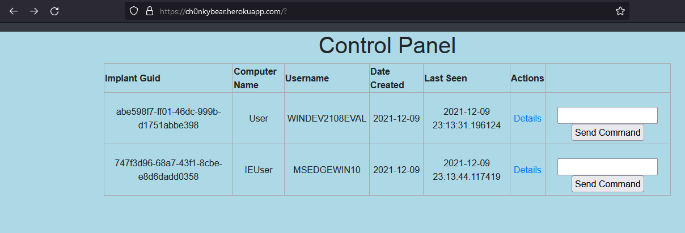
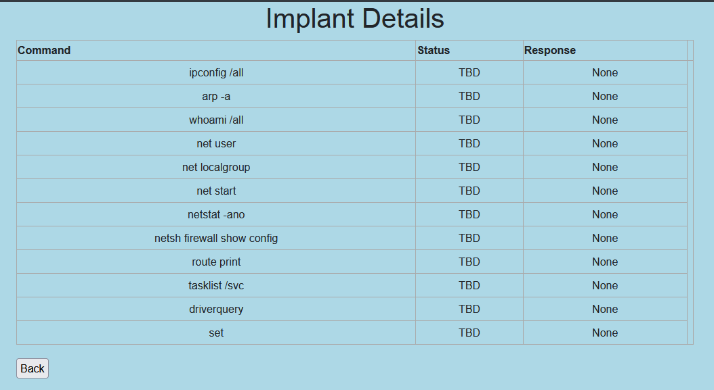
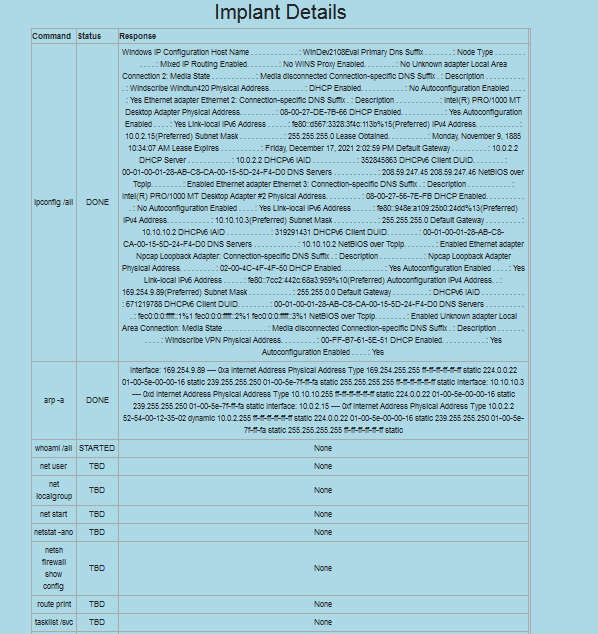

# C2 Server

Ch0nkyBear server is hosted on https://ch0nkybear.herokuapp.com/

- Using Python Flask as primary listener with Gunicorn as WSGI
- MySQL as backend database

## Features

- Stores client, target and job details
- Checks if request header for an exe contains User-Agent: ch0nky (emulates ch0nky, ensures only implant downloads the exe, unintended entities download calculator exe)
- User authentication
- Incoming request hex encoded
- Send command to specific implants








## Run Instructions:

Activate virtual env and run app:
```sh
source env/bin/activate
(env) python3 app.py
```

To create a new database (open python shell):
```sh
python3
>>> from app import db
>>> db.create_all()
```

To download all required dependencies locally:
```sh
pip3 install -r requirements.txt
```
